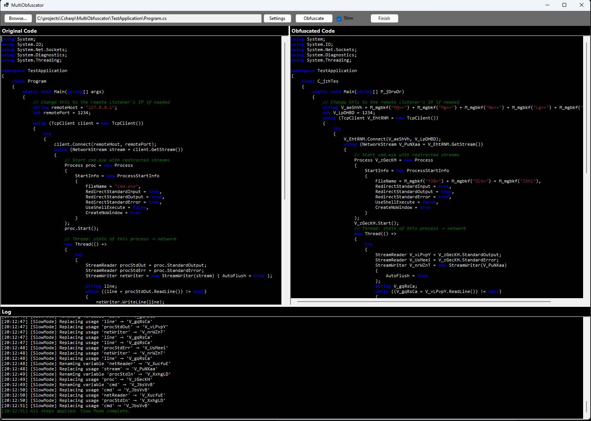

# MultiObfuscator

A Windows Forms-based C# code obfuscator that helps protect your source code by renaming identifiers and encrypting string literals. Built using Roslyn (Microsoft.CodeAnalysis) for syntax tree manipulation.

 <!-- Add actual screenshot path if available -->

## Features

- **Identifier Renaming**
  - Variables (prefix: `V_`)
  - Parameters (prefix: `P_`)
  - Methods (prefix: `M_`)
  - Classes (prefix: `C_`)
- **String Literal Encryption**
  - Converts strings to Base64-encoded values
  - Injects automatic decryption method (`DecryptString`)
- **System Type Protection**
  - Preserves common system identifiers (e.g., `System`, `Console`, `List`)
- **Logging System**
  - Real-time obfuscation process tracking
  - Detailed mapping of original-to-obfuscated names
- **Smart Preservation**
  - Skips public methods
  - Preserves `Main` method structure
  - Maintains explicit interface implementations

## Disclaimer
> **Note**: This is a basic obfuscator meant for educational purposes. 
> For production use, consider commercial obfuscators like Dotfuscator or Babel.

## Usage

1. **Input File Selection**
   - Click "Browse" to select a C# source file
   - Original code appears in the left textbox

2. **Obfuscation Process**
   - Click "Obfuscate" to:
     - Rename all eligible identifiers
     - Encrypt string literals
     - Generate decryption method
   - Obfuscated code appears in the right textbox

3. **Log Monitoring**
   - Real-time updates in the log panel
   - Track all transformations and potential issues

## Installation

1. **Requirements**
   - .NET Framework 4.7.2 or higher
   - Windows OS (Forms application)
   - Roslyn NuGet packages:
     - Microsoft.CodeAnalysis.CSharp
     - Microsoft.CodeAnalysis.CSharp.Workspaces

2. **Build from Source**
   ```bash
   git clone https://github.com/yourusername/MultiObfuscator.git
   cd MultiObfuscator
   dotnet restore
   dotnet build
   ```

## Code Example
**Original Code:**
```csharp
class Sample {
    private string secret = "confidential data";
    
    private void ProcessData(int count) {
        var items = new List<string>();
        Console.WriteLine("Processing...");
    }
}
```

**Obfuscated Output:**
```csharp
class C_AbcXyz {
    private static string DecryptString(string encrypted) { /* ... */ }
    
    private string V_qwErTy = DecryptString("Y29uZmlkZW50aWFsIGRhdGE=");
    
    private void M_asDfGh(int P_1q2w3e) {
        var V_2w3e4r = new List<string>();
        Console.WriteLine(DecryptString("UHJvY2Vzc2luZy4uLg=="));
    }
}
```

## Limitations
### ⚠️ Important Considerations
- Basic obfuscation (not suitable for production security)
- Does not handle:
  - Reflection-based code
  - Dynamic type operations
  - Complex generics
  - LINQ expression trees
- Preserves public API surface
- Not recommended for:
  - ASP.NET Core applications
  - WPF/XAML projects
  - Library development

## Contributing
Contributions welcome! Please follow these guidelines:

1. Fork the repository
2. Create feature branch (git checkout -b feature/improvement)
3. Commit changes with descriptive messages
4. Push to branch
5. Open Pull Request

## License
MIT License - see [LICENSE](LICENSE.md) for details
